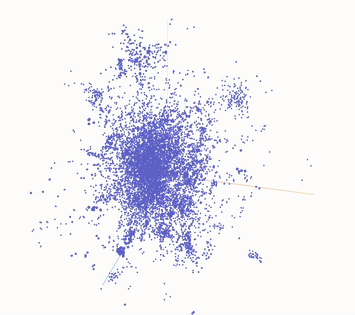

# Video Deduplication

A FAISS-based system for identifying duplicate and similar videos and images using embedding similarity search.

## Overview

This uses FAISS (Facebook AI Similarity Search) to detect duplicate videos by comparing their embeddings. 

## Why This Matters

Manual deduplication of scraped datasets is time consuming. Automating this process saves researchers hundreds of hours and more accurate.

## Features

- Video & image clip-level deduplication using embeddings
- FAISS-based similarity search
- Chosing duplicates according to heuristics of quality and size

## Core Functions

### `build_id_lookup()`
Maps FAISS IDs to file metadata.

### `collect_groups()`
Finds neighbors within similarity radius and builds connected components using DFS. Radius of 0.9999 targets exact duplicates; 0.99 finds similar content.

### `write_dedup_jsonl()`
Outputs results as JSONL with one line per duplicate pair, including all matched clips.

<figure>
  
  <figcaption>3D Visualization of high dimensional embedding space</figcaption>
</figure>

## How It Works

CLIP models map images and text into the same embedding space, where visually similar content clusters together. This means duplicate videos get nearly identical embeddings. The system uses FAISS range search to find all embeddings within a similarity threshold, then applies DFS to group transitive duplicates—if video A matches B and B matches C, they're all grouped together.

The result is a list of duplicate pairs at the file and clip level, ready for researchers to review.

